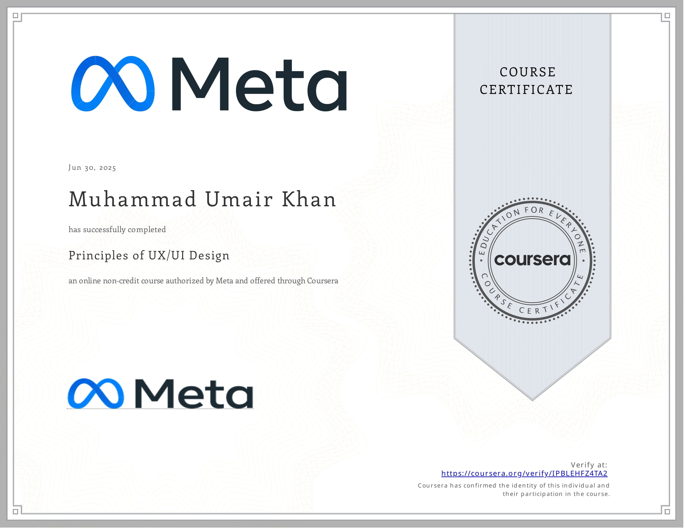

# 🌐 My Portfolio Website

A modern personal portfolio website showcasing my skills, projects, certificates, and contact details.  
Built using **HTML, CSS, and JavaScript**.

---

## 🚀 Features

- 🏠 **Homepage** – Introduction and personal profile  
- 💼 **Projects** – Highlight of my work and achievements  
- 📜 **Certificates** – Showcase of earned certifications  
- 🛍️ **E-commerce Demo** – Sample project page  
- 📬 **Contact Page** – Easy way to reach out  

---

## 📸 Preview

### Certificates Section

---

## 🛠️ Technologies Used

- **HTML5** – structure  
- **CSS3** – styling and responsive design  
- **JavaScript (ES6)** – interactivity  

--

